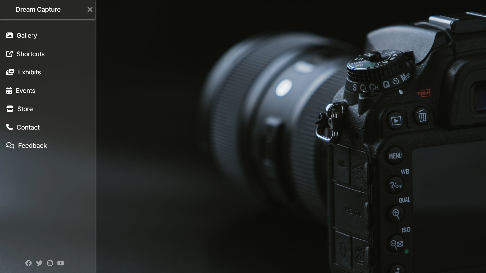

# This is my first miniproject using HTML & CSS.

#Dream Capture

Dream Capture is a simple photography website created using HTML and CSS.It showcases a modern dark-themed design to display photography work.

🌟 Features

📷 Full-screen hero image
📂 Sidebar navigation (Gallery, Events, Store, Contact)
🌙 Dark UI design
📱 Responsive layout

🛠️ Technologies Used

HTML5
CSS3

🚀 How to Run

1. Download or clone the repository
2. Open the project folder
3. Open index.html in your browser

📁 Project Structure

Dream-Capture/
│── index.html
│── style.css
│── images/
│── screenshot.png

📸 Preview

📌 Purpose

This project is built for practicing web development and creating a basic photography website.

Author
Shivani Dharmadhikari